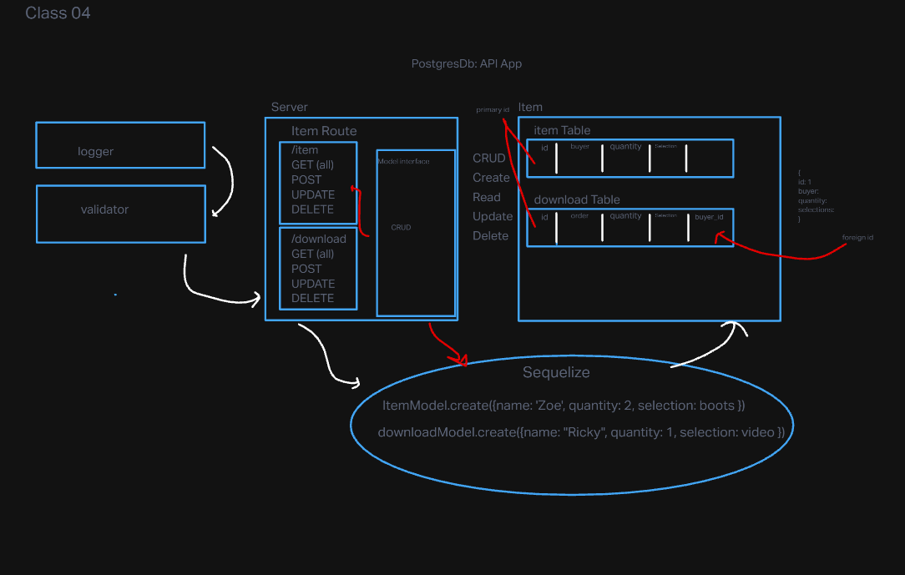

# API-SERVER

## Project: API Server

## Author: Zoe Gonzalez

### Problem Domain: This application was created in order to help me understand CRUD and SQL database management. This expands off yesterday's lab by employing class characteristic off of CRUD capabilities from the two created routes. It also introduces SQL relations.

GitHub Actions: https://github.com/ZuSolaris/api-server/actions

Production Deployment: https://dashboard.render.com/web/srv-ce4pjfhgp3jkq2r3p9ag/deploys/dep-ce4pjgpgp3jkq2r3paag

### Setup

#### env requirements

see `.env.sample`

PORT: 3001 

DATABASE_URL:postgres://localhost:5432/sql-test?sslmode=disable

## How to initalize application

'npm start'

'nodemon'

'npm test'

## How to use your library

-nodemon for starting

-npm test for testing

## Features / Routes

/ : automatically redirects you to the page.

/bad: Sends you to an error page.

/item: Sends you to a general item directory with the selected name. 

/item:id : Sends you to a general item directory with the selected and associated id. 

/download: Sends you to a general download directory with the selected name. 

/download:id : Sends you to a general item directory with the selected and associated id. 

/* : If the page is not available then an error flag is thrown.

